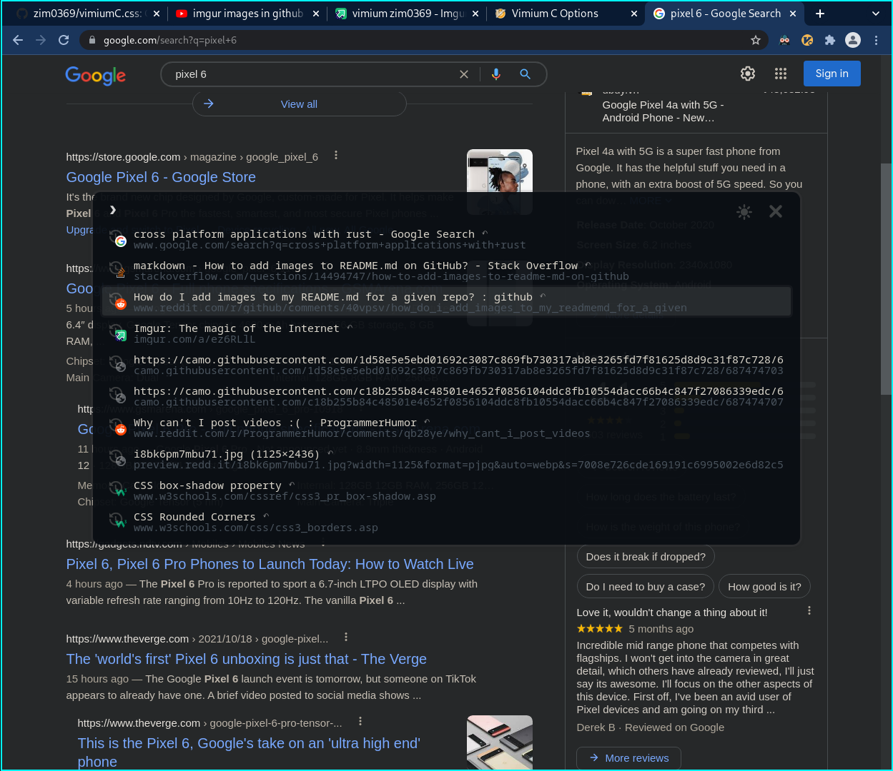
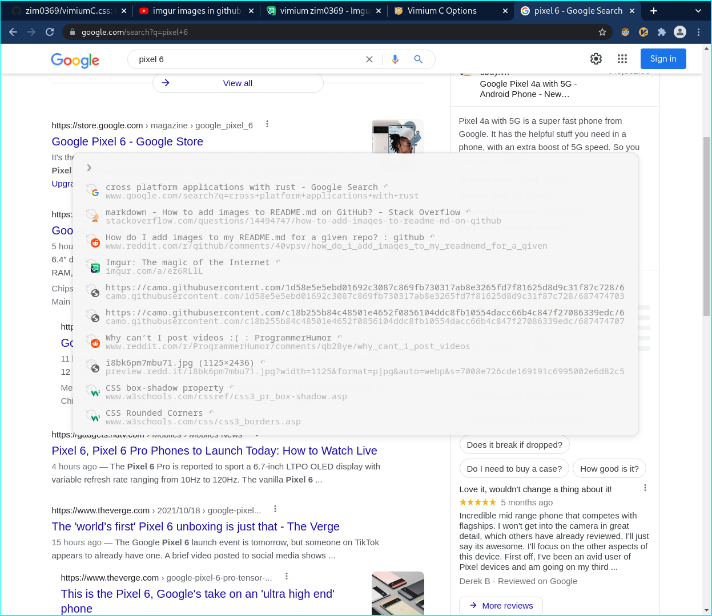
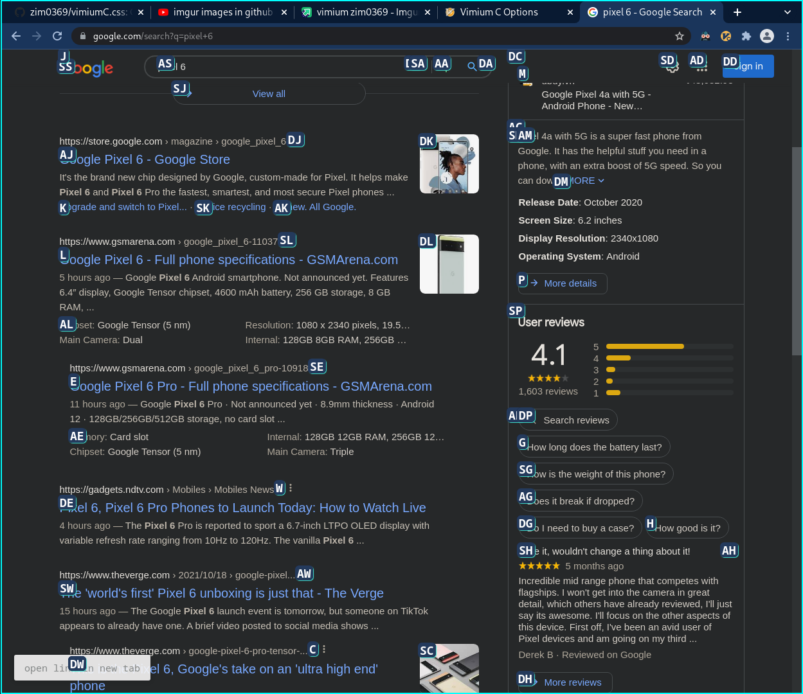
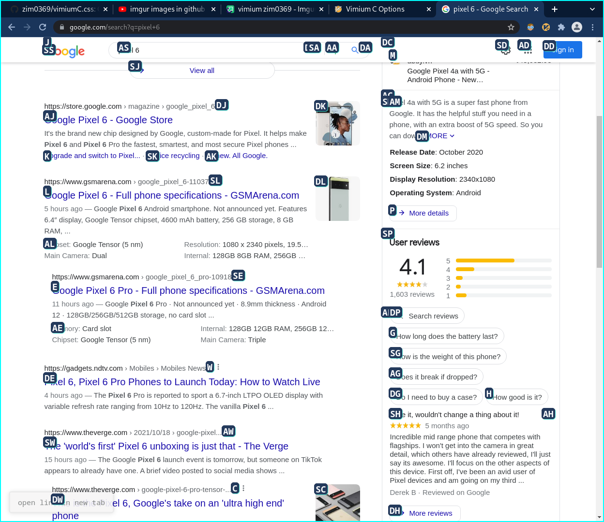

# vimiumC.css

### Custom CSS for vimiumC(not [vimium](https://github.com/zim0369/vimium.css)) vomnibar and vimiumC hint markers.

**NOTE**: 
+ Tested only for chromium based browsers.
+ You need to press `gn`(default) to switch between light and dark theme for vomnibar.
+ Copy the vimiumC.css file to the 'custom css' pane in vimiumC's options tab. 
+ For search engine prefixes in vomnibarC, copy the vimiumC.search file to the 'custom search engines' pane in vimium's options tab.

